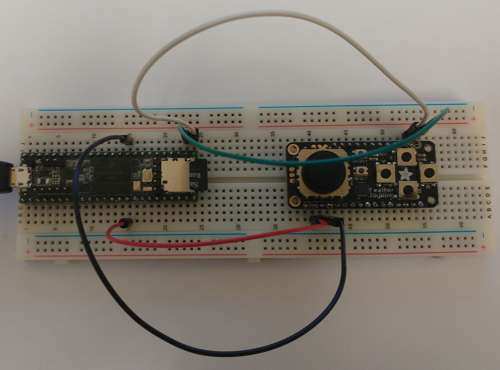

# JoyTest
Teensy 3.5 connected via i2c to a Feather JoyWing

Joy is a simple class for handling the connection with the [Feather JoyWing](https://learn.adafruit.com/joy-featherwing/overview) mini-joystick, keeping the connection asynchronous as far as possible.
This uses the [nox771/i2c_t3](https://github.com/nox771/i2c_t3) variation on the Arduino Wire library for Teensy, as well as Teensy's [elapsedMicros](https://www.pjrc.com/teensy/td_timing_elaspedMillis.html) class.
